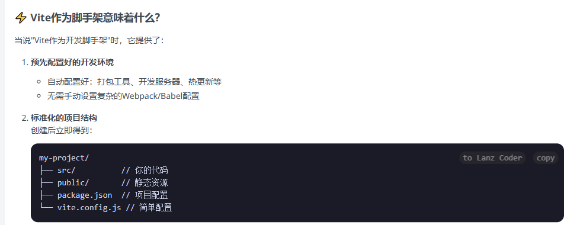

# ⚛️ React 火箭班（7天升空）

**目标**：掌握组件开发 + Hooks + 状态管理 + 路由

## 🔍 前置要求
- JavaScript 基础（完成JS计划）

## 📅 详细学习计划

### Day 1：React 初体验与组件基础

#### 1. 什么是 React？
- **核心理念**：把用户界面（UI）想象成一堆可复用的 **积木**。React 就是帮你管理这些积木的工具。
- **声明式**：你只需要告诉 React **希望看到什么样** 的界面（比如，“这里应该有一个红色的按钮”），React 会自动帮你完成所有 DOM 操作，你不用再手动 `document.querySelector` 了。

#### 2. 环境搭建
- **推荐工具**：Vite 是目前最快、最流行的 React 开发工具。
- **创建项目**：打开终端，运行以下命令：
  ```powershell
  # npm 7+
  npm create vite@latest my-react-app -- --template react

  # 进入项目目录并安装依赖
  cd my-react-app
  npm install

  # 启动项目
  npm run dev
  ```
  浏览器会自动打开一个本地网址，看到 React 的 Logo 就说明成功了！
  

#### 3. JSX 与函数组件
- **JSX**：是 JavaScript 的扩展语法，让你能在 JS 文件里像写 HTML 一样写界面。
- **函数组件**：就是一个返回 JSX 的 JavaScript 函数。组件名的首字母必须大写！为了和HTML标签区分，该标签是小写。

#### 4. Props：给组件传递信息
- **Props** (Properties) 就像函数的参数，允许你从父组件向子组件传递数据。

#### 5. 今日实战练习
- **任务**：实现一个“问候语”组件，可以接收一个 `name` 属性，并显示 "Hello, [name]!"。

```jsx
// src/App.jsx

// 1. 定义你的组件
function Greeting(props) {
  // props 是一个对象，包含了父组件传来的所有属性
  // 例如 { name: "Alice" }
  return <h1>Hello, {props.name}!</h1>;
}

// 2. 在 App 组件中使用它
function App() {
  return (
    <div>
      <Greeting name="Alice" />
      <Greeting name="Bob" />
      <Greeting name="World" />
    </div>
  );
}

export default App;
```

---

### Day 2：组件进阶与事件处理

#### 1. 事件处理
- 在 JSX 中，事件名使用驼峰式命名（如 `onClick`），事件处理函数直接用 `{}` 包裹。

#### 2. 条件渲染
- 根据不同的条件，显示不同的内容。最常用的是 **三元运算符** 或 `&&` 语法。

#### 3. 列表渲染
- 使用数组的 `.map()` 方法来遍历数据，为每个数据项生成一个组件。
- **关键点**：为列表中的每个元素提供一个独一无二的 `key` 属性，帮助 React 识别它们。

#### 4. 今日实战练习
- **任务**：实现一个简易“待办事项”列表，可以添加和显示事项。

```jsx
// src/App.jsx
// (需要先安装 useState，这是 Day 3 的内容，这里提前预览)
import { useState } from 'react';

function App() {
  const [todos, setTodos] = useState(['学习 React', '写代码']);
  
  const handleAddTodo = () => {
    const newTodo = prompt("请输入新的待办事项:");
    if (newTodo) {
      // 不能直接修改原数组，要创建一个新数组
      setTodos([...todos, newTodo]);
    }
  };

  return (
    <div>
      <button onClick={handleAddTodo}>添加待办</button>
      <ul>
        {/* 使用 map 遍历数组，为每个 todo 生成一个 li */}
        {todos.map((todo, index) => (
          <li key={index}>{todo}</li>
        ))}
      </ul>
      {/* 条件渲染：没有待办事项时显示提示 */}
      {todos.length === 0 && <p>太棒了，所有事情都做完了！</p>}
    </div>
  );
}

export default App;
```

---

### Day 3：Hooks 基础 (useState/useEffect)

Hooks 是让函数组件拥有类组件功能（如 state）的“钩子”。

#### 1. `useState`：组件的记忆
- `useState` 为组件添加一个 “状态(state)”。当状态改变时，React 会自动重新渲染组件。
- 它返回一个数组：`[当前状态, 更新状态的函数]`。

#### 2. `useEffect`：处理副作用
- **副作用**：组件渲染之外的操作，比如网络请求、DOM 操作、定时器等。
- `useEffect(fn, [deps])`：
  - `fn`：要执行的副作用函数。
  - `[deps]` (依赖数组)：
    - 不传：每次渲染后都执行。
    - `[]` (空数组)：只在组件第一次渲染后执行一次。
    - `[state, props]`：当数组中的任何一个值变化时，才执行。

#### 3. 今日实战练习
- **任务**：实现一个“计数器”组件，有一个按钮可以加一，并用 `useEffect` 在标题中显示当前计数值。

```jsx
// src/App.jsx
import { useState, useEffect } from 'react';

function Counter() {
  const [count, setCount] = useState(0);

  // 依赖数组是 [count]，所以只在 count 变化时执行
  useEffect(() => {
    document.title = `你点击了 ${count} 次`;
    console.log('useEffect 执行了');
  }, [count]);

  return (
    <div>
      <p>你点击了 {count} 次</p>
      <button onClick={() => setCount(count + 1)}>
        点我
      </button>
    </div>
  );
}

export default Counter;
```

---

### Day 4：父子通信与 Context

#### 1. 父子通信
- **父 -> 子**：通过 `props` 传递。
- **子 -> 父**：在 `props` 中传递一个 **函数**，子组件调用这个函数，从而将信息传回给父组件。

#### 2. `Context`：跨层数据传送门
- 当组件层级很深，一层层传递 `props` 会很繁琐（称为 "prop drilling"）。
- `Context` 提供了一种让数据可以被组件树中的所有组件访问的方式，而无需手动传递。

#### 3. 今日实战练习
- **任务**：实现一个“主题切换”功能。顶层组件控制主题色，深层的子组件能自动应用主题色。

```jsx
// src/ThemeContext.js
import { createContext } from 'react';
export const ThemeContext = createContext('light'); // 默认值是 light

// src/App.jsx
import { useState, useContext } from 'react';
import { ThemeContext } from './ThemeContext';

function App() {
  const [theme, setTheme] = useState('light');
  const toggleTheme = () => setTheme(theme === 'light' ? 'dark' : 'light');

  return (
    // 使用 Provider 将 theme 值提供给所有子组件
    <ThemeContext.Provider value={theme}>
      <button onClick={toggleTheme}>切换主题</button>
      <Toolbar />
    </ThemeContext.Provider>
  );
}

function Toolbar() {
  // Toolbar 组件不需要知道 theme，直接渲染子组件
  return <ThemedButton />;
}

function ThemedButton() {
  // 使用 useContext 直接获取最近的 Provider 提供的值
  const theme = useContext(ThemeContext);
  const style = {
    background: theme === 'dark' ? '#333' : '#FFF',
    color: theme === 'dark' ? '#FFF' : '#333',
  };
  return <button style={style}>我是一个带主题的按钮</button>;
}

export default App;
```

---

### Day 5：路由与页面切换

在单页面应用（SPA）中，我们用路由来模拟不同页面之间的跳转。

#### 1. 安装与设置
```powershell
npm install react-router-dom
```
在 `main.jsx` 中用 `<BrowserRouter>` 包裹你的 `<App />` 组件。

#### 2. 核心组件
- `<Routes>`：路由的容器。
- `<Route path="/path" element={<Component />} />`：定义一条路由规则。
- `<Link to="/path">Go to Path</Link>`：生成一个 `<a>` 标签用于导航，但不会刷新页面。
- `useNavigate()`：一个 Hook，让你在函数中进行编程式导航。

#### 3. 今日实战练习
- **任务**：实现“首页/关于/404”三页面切换。

```jsx
// src/App.jsx
import { Routes, Route, Link, BrowserRouter } from 'react-router-dom';

const Home = () => <h2>首页</h2>;
const About = () => <h2>关于我们</h2>;
const NotFound = () => <h2>404 - 页面未找到</h2>;

function App() {
  return (
    <BrowserRouter>
      <nav>
        <Link to="/">首页</Link> | {' '}
        <Link to="/about">关于</Link>
      </nav>
      <Routes>
        <Route path="/" element={<Home />} />
        <Route path="/about" element={<About />} />
        <Route path="*" element={<NotFound />} /> {/* * 匹配所有未匹配到的路径 */}
      </Routes>
    </BrowserRouter>
  );
}

export default App;
```

---

### Day 6：状态管理进阶

#### 1. 状态提升 (Lifting State Up)
- 当多个子组件需要共享同一个状态时，最好的方法是 **将这个状态提升到它们最近的共同父组件中**。由父组件统一管理，再通过 `props` 分发给子组件。

#### 2. 全局状态管理
- 当“状态提升”变得过于复杂，或者很多不相关的组件都需要访问同一个状态时，就需要引入全局状态管理方案。
- **`useContext`** 是最简单的全局状态管理方案，适合中小型项目。
- **Redux / Zustand** 是更强大的库，提供了更完善的工具链，适合大型复杂项目。

#### 3. 今日实战练习
- **任务**：使用 `useContext` 管理一个全局的“用户登录”状态。

```jsx
// src/AuthContext.js
import { createContext, useState, useContext } from 'react';
const AuthContext = createContext(null);

export const AuthProvider = ({ children }) => {
  const [user, setUser] = useState(null); // user 为 null 表示未登录
  const login = (username) => setUser({ name: username });
  const logout = () => setUser(null);
  return (
    <AuthContext.Provider value={{ user, login, logout }}>
      {children}
    </AuthContext.Provider>
  );
};

export const useAuth = () => useContext(AuthContext);

// src/main.jsx
// ...
root.render(
  <React.StrictMode>
    <AuthProvider> {/* 用 AuthProvider 包裹整个应用 */}
      <App />
    </AuthProvider>
  </React.StrictMode>
);

// src/App.jsx
import { useAuth } from './AuthContext';

function App() {
  const { user, login, logout } = useAuth();

  return (
    <div>
      {user ? (
        <div>
          <p>欢迎, {user.name}!</p>
          <button onClick={logout}>退出登录</button>
        </div>
      ) : (
        <button onClick={() => login('小明')}>登录</button>
      )}
    </div>
  );
}

export default App;
```

---

### Day 7：实战项目——PM2.5 仪表盘

这个项目将综合运用前面六天学到的所有知识。

#### 1. 需求分析与页面结构设计
- **组件拆分**：
  - `DashboardPage`：主页面，包含标题和布局。
  - `CitySelector`：一个下拉框，用于选择城市。
  - `DataDisplay`：用于显示从 API 获取到的 PM2.5 数据。
  - `Chart`：使用图表库（如 Recharts）将数据可视化。

#### 2. 使用 `useEffect` 拉取实时数据
- 在 `DashboardPage` 组件中，使用 `useEffect`。当选择的城市变化时，重新从 API 获取数据。

#### 3. 城市选择器与数据联动
- `CitySelector` 组件的状态（当前选中的城市）需要被提升到 `DashboardPage` 中管理。
- 当 `CitySelector` 的值改变时，调用从父组件传来的函数来更新 `DashboardPage` 中的城市状态。

#### 4. 使用第三方图表库
- 安装 `recharts`：`npm install recharts`
- 参考其文档，将获取到的数据传入图表组件。

#### 5. 项目部署到 Vercel
- 将你的代码推送到 GitHub 仓库。
- 使用你的 GitHub 账号登录 Vercel，导入你的项目仓库，点击部署即可。

## 📚 资源推荐
- 官方修炼场：[React Beta 文档](https://beta.reactjs.org/)
- 交互式沙盒：[CodeSandbox React](https://codesandbox.io/s/react-new)
- 动画教程：[React 可视化教程](https://react.gg/)
